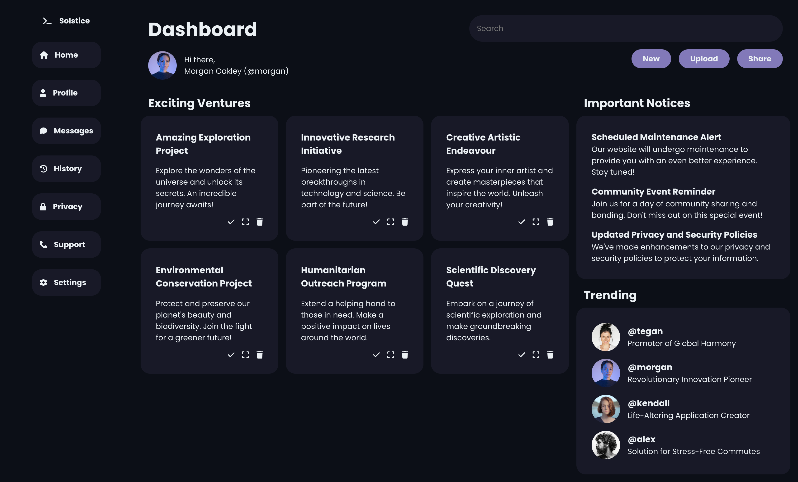
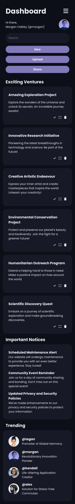
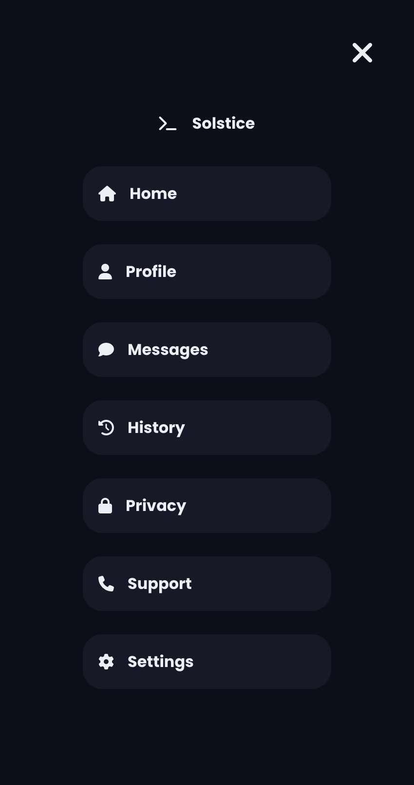
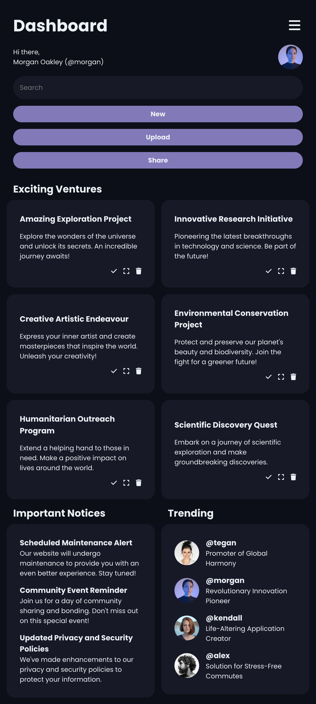

# The Odin Project - Admin Dashboard Project

## Task

Create an Admin Dashboard page relying on Grid for the main layout.

## Main Takeaways

- Using ```repeat()``` with ```minmax()``` to create a responsive grid layout.
- Creating a mobile navigation with JavaScript.

## Screenshots

Desktop


Mobile


Mobile Navigation


Tablet

